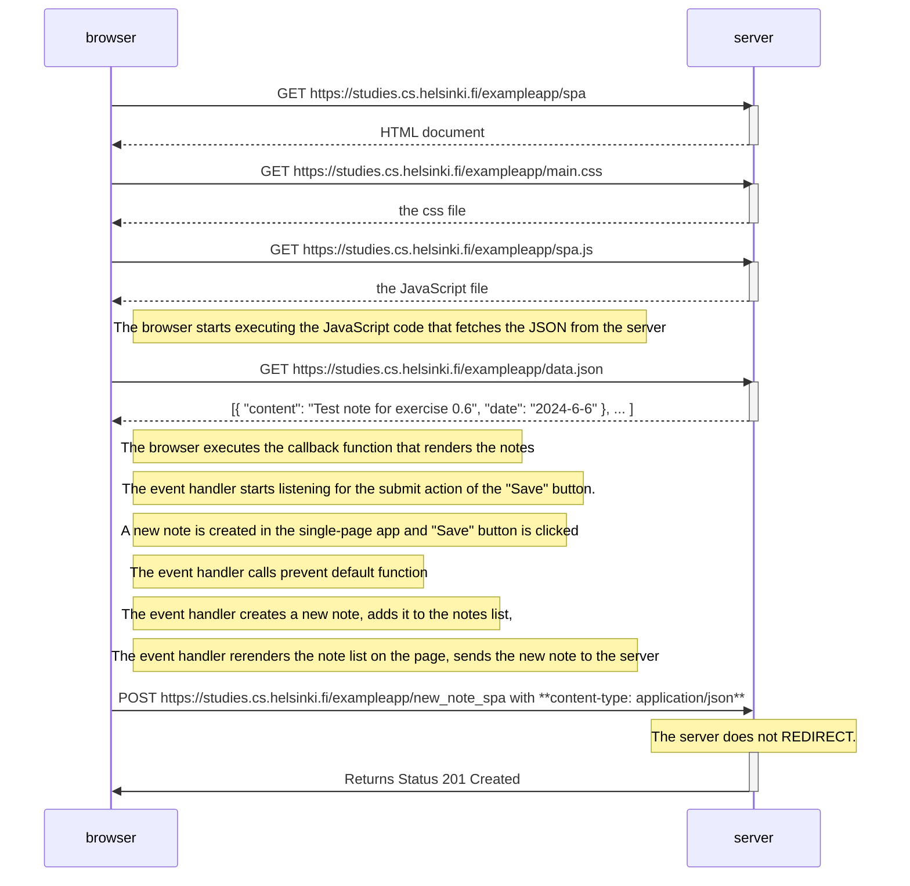

```mermaid
    sequenceDiagram
        participant browser
        participant server
    
        browser->>server: GET https://studies.cs.helsinki.fi/exampleapp/spa
        activate server
        server-->>browser: HTML document
        deactivate server
    
        browser->>server: GET https://studies.cs.helsinki.fi/exampleapp/main.css
        activate server
        server-->>browser: the css file
        deactivate server
    
        browser->>server: GET https://studies.cs.helsinki.fi/exampleapp/spa.js
        activate server
        server-->>browser: the JavaScript file
        deactivate server
    
        Note right of browser: The browser starts executing the JavaScript code that fetches the JSON from the server
    
        browser->>server: GET https://studies.cs.helsinki.fi/exampleapp/data.json
        activate server
        server-->>browser: [{ "content": "Test note for exercise 0.6", "date": "2024-6-6" }, ... ]
        deactivate server

        Note right of browser: The browser executes the callback function that renders the notes

        Note right of browser: The event handler starts listening for the submit action of the "Save" button. 
        Note right of browser: A new note is created in the single-page app and "Save" button is clicked
        Note right of browser: The event handler calls prevent default function
        Note right of browser: The event handler creates a new note, adds it to the notes list, 
        Note right of browser: The event handler rerenders the note list on the page, sends the new note to the server

        browser->>server: POST https://studies.cs.helsinki.fi/exampleapp/new_note_spa with **content-type: application/json**
        Note over server: The server does not REDIRECT.

        activate server
        server->>browser: Returns Status 201 Created
        deactivate server
       
```